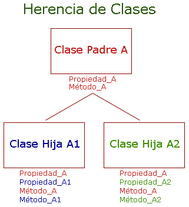
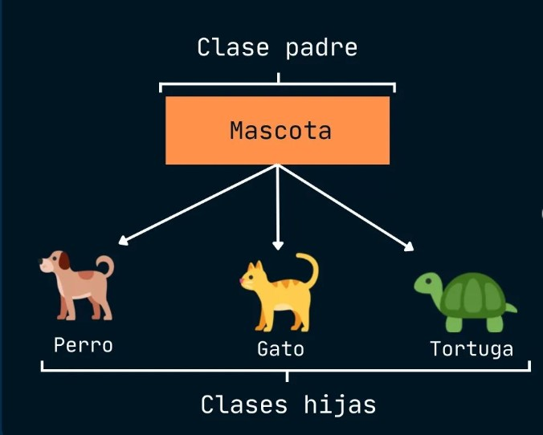

```{r collapse=TRUE, collapse=TRUE, message=FALSE, warning=FALSE, include=FALSE}
library(sloop)
library(R6)
```


# Programación orientada a objetos (POO)
## Introducción

En primer lugar debemos tener en mente que la POO en R presenta ciertos desafíos en comparación con otros lenguajes esto debido a :

- La presencia de más de un  sistema de OOP para elegir. Dentro de los más importantes tenemos : S3, R6 y S4. Donde S3 y S4 vienen en R base y R6 en el paquete con la misma denominación 

- Dentro de la comunidad existe discrepancia sobre la importancia  de los sistemas POO mencionados , pues algunos  consideran que el orden de importancia es S3,R6 y S4 pero por otro lado otros consideran que S3 se debe evitar.

- La sintaxis utilizada para  la implementación de la POO en R en comparación con otros lenguajes populares es diferente.

Aunque  la programación funcional es más utilizada en R que la POO, es importante comprender estos sistemas por las siguientes razones :

- S3  permite que las funciones devuelvan resultados con una visualización amigable y una estructura interna agradable para el programador. S3 se utiliza en todo R base, por lo que es importante dominarlo si se desea modeificar las funciones de R base para trabajar con nuevos tipos de entrada.

- R6  proporciona una forma de escapar de la semántica copy-on-modify de R. Esto es especialmente importante si se desea modelar objetos que existen independientemente de R. Hoy en día, una necesidad común de R6 es modelar datos que provienen de una API web, y donde los cambios provienen de dentro o fuera de R.

- S4 es un sistema riguroso que obliga a pensar detenidamente en el diseño de los programas. Es adecuado para la construcción de grandes sistemas que evolucionan con el tiempo y recibirán contribuciones de muchos programadores.

En resumen  la programación orientada a objetos (POO) en R presenta  sus desafíos únicos debido a la presencia de múltiples sistemas  y desacuerdos sobre su importancia relativa donde también es fundamental tener idea de  sus aplicaciones y razones para aprender cada uno, aunque su uso efectivo puede ser complejo y requiere un tratamiento más detallado.

## Sistemas de programación orientada a objetos

La principal razón para utilizar la POO es el polimorfismo. El polimorfismo significa que un programador puede considerar la interfaz de una función separadamente de su implementación, lo cual hace posible usar la misma forma de función para diferentes tipos de entrada.Esto está estrechamente relacionado con la idea de encapsulación: el usuario no necesita preocuparse por los detalles de un objeto porque están encapsulados tras una interfaz estándar.

Para ejemplificar esta idea, el polimorfismo es lo que permite a summary() producir diferentes salidas para diferentes entradas:

```{r, collapse=TRUE}
#Utilizamos el dataframe diamonds
diamonds <- ggplot2::diamonds
#carat: variable cuantitativa
summary(diamonds$carat)
#cut: Variable cualitativa
summary(diamonds$cut)

```
Esto no implica que  summary() contenga una serie if-else para cada caso.

Los sistemas de  POO llaman clase a lo que define que es un objeto y  los métodos describen lo que ese objeto puede hacer. La clase define los campos, los datos que posee cada instancia de esa clase. Las clases se organizan en una jerarquía de forma que si un método no existe para una clase, se utiliza el método de su padre, y se dice que el hijo hereda el comportamiento. Por ejemplo, en R, un factor ordenado hereda de un factor regular, y un modelo lineal generalizado hereda de un modelo lineal. El proceso de encontrar el método correcto dada una clase se denomina despacho del método.


<center>



</center>


### Paradigmas

Existen dos paradigmas principales de POO :  encapsulado y funcional:

En la **POO encapsulada**, los métodos pertenecen a objetos o clases, y las llamadas a métodos suelen tener el aspecto de object.method(arg1, arg2). Se denomina encapsulada porque el objeto encapsula tanto los datos (con campos) como el comportamiento (con métodos), y es el paradigma que se encuentra en los lenguajes más populares.

En la **POO funcional**, los métodos pertenecen a funciones genéricas, y las llamadas a métodos parecen llamadas a funciones ordinarias: generic(object, arg2, arg3). Esto se llama funcional porque desde fuera parece una llamada a una función normal, e internamente los componentes también son funciones.


### Especificaciones de los principales sistemas POO en R


Sistemas OOP del R base: S3, S4 y RC :

**S3** es el primer sistema POO de R, el cual  es una implementación informal de POO funcional y se basa en convenciones comunes en lugar de garantías férreas. Esto hace que sea fácil empezar a trabajar con él, proporcionando una forma de óptima de resolver muchos problemas sencillos.

**S4** es una reescritura formal y rigurosa de S3, esta requiere más trabajo inicial que S3, pero a cambio proporciona más garantías y una mayor encapsulación. S4 se implementa en el paquete de métodos base, que siempre se instala con R.

**RC** implementa POO encapsulada. Los objetos RC son un tipo especial de objetos S4 que también son mutables, es decir, en lugar de utilizar la semántica habitual de R de copy-on-modify, pueden modificarse en el lugar. Esto los hace más difíciles de razonar, pero les permite solucionar problemas que son difíciles de resolver en el estilo funcional POO de S3 y S4.

El sistema POO  proporcionado por paquete CRAN de nuestro interes es:

**R6** implementa POO encapsulada como RC, pero resuelve algunos problemas importantes.Mas adelante se aprenderá  a detalle sobre el uso R6 .

# Tipos de bases

Para tratar el tema  de objetos y POO en R, en primer lugar se tiene que aclarar la confusión entre los  usos de la palabra "objeto".Por lo general se piensa que  "Todo lo que existe en R es un objeto", sin embargo, aunque todo es un objeto, no todo está orientado a objetos. Esta confusión surge porque los objetos base proceden de S, y se desarrollaron antes de que nadie pensara que S podría necesitar un sistema POO.

Los términos que se usan para diferenciar los dos tipos de objeto son: **objetos base y objetos OO para distinguirlos.**

## Objetos Base vs Objetos OO

Para diferenciar entre un objeto base y uno OO, se utiliza is.object() o sloop::otype()

```{r, collapse=TRUE}

#EJEMPLO 1
# UN OBJETO BASE:
is.object(1:10)

sloop::otype(1:10)

# Utilizamos el dataframe mtcars

# UN OBJETO OO

is.object(mtcars)

sloop::otype(mtcars)


```
Para diferenciarlos también se puede tomar en cuenta que solo los objetos OO tienen el atributo "**class**"

```{r, collapse=TRUE}
#Objeto base
attr(1:10, "class")


#Objeto OO
attr(mtcars, "class")

```

por otro lado cada objeto tiene un **base type**:


```{r, collapse=TRUE}
#Objeto Base
typeof(1:10)


#Objeto OO
typeof(mtcars)

```
En total, hay 25 tipos de bases **base type** diferentes.Estos tipos son más importantes en código C, por lo que a menudo se verán llamados por sus nombres de tipo C (estos se encuentran en paréntesis). Los presentamos a continuación


**Para vectores** tenemos los tipos :

| Tipo              | Descripción                     |
|---------------    |---------------------------------|
| NULL (NILSXP)     | Tipo nulo                       |
| logical (LGLSXP)  | Tipo lógico                     |
| integer (INTSXP)  | Tipo entero                     |
| double (REALSXP)  | Tipo decimal de precisión doble |
| complex (CPLXSXP) | Tipo complejo                   |
| character (STRSXP)| Tipo caracter                   |
| list (VECSXP)     | Tipo lista                      |
| raw (RAWSXP)      | Tipo de datos binarios          |


```{r, collapse=TRUE}
#EJEMPLOS

#NULL
typeof(NULL)


#integer
typeof(1L)


#COMPLEX
typeof(1i)

```

**Para funciones** :

| Tipo                | Descripción                         |
|-------------------- |-------------------------------------|
| closure (CLOSXP)    | Funciones regulares de R            |
| special (SPECIALSXP)| Funciones internas de R             |
| builtin (BUILTINSXP)| Funciones primitivas de R           |


```{r, collapse=TRUE}
#Ejemplos

typeof(mean) #closure

typeof(`[`) #special

typeof(sum) #builtin

```
**Para Entornos :**  environment (ENVSXP).

```{r, collapse=TRUE}
#Ejemplos
typeof(globalenv())
```

**Para Componentes de Lenguaje :** incluyen 

| Tipo                  | Información extra                                 |
|-----------------------|---------------------------------------------------|
| symbol (SYMSXP)       | Conocido como:name                                |
| language (LANGSXP)    | Conodido como: calls                              |
| pairlist (LISTSXP)    | Utilizado para los argumentos de funciones        |


```{r, collapse=TRUE}
#Ejemplos

# "symbol"
typeof(quote(a))

#"language"
typeof(quote(a + 1))

#"pairlist"
typeof(formals(mean))

```
Los tipos restantes son esotéricos y raramente vistos en R. Son importantes principalmente para el código C: externalptr (EXTPTRSXP), weakref (WEAKREFSXP), bytecode (BCODESXP), promise (PROMSXP), ... (DOTSXP), and any (ANYSXP).


Ahora hay que tener cuidado al momento de referirnos  sobre los tipos númericos : **numeric type** , pues el tipo **numeric** en R suele utilizarce para referirse a 3 cosas ligeramentes distintas :


  * En algunos lugares **numeric** se utiliza como alias del tipo double. Por ejemplo `as.numeric()` es idéntico a `as.double()`, y `numeric()` es idéntico a `double()`.

  (R también utiliza ocasionalmente real en lugar de double; `NA_real_` es el único lugar donde es probable encontrar esto en la práctica).
  
  * En los sistemas S3 y S4, numeric se utiliza como una abreviatura para el tipo integer o double, y se utiliza cuando se seleccionan métodos:


```{r, collapse=TRUE}

#EJEMPLOS

#"double" "numeric"
sloop::s3_class(1)

#"integer" "numeric"
sloop::s3_class(1L)

```

  * `is.numeric()` comprueba so  los objetos se comportan como números . Por ejemplo, los factores tienen tipo "entero" pero no se comportan como números (es decir, no tiene sentido tomar la media del factor).
```{r, collapse=TRUE}

#Factor es tipo entero 
typeof(factor("x"))


# Pero NO SE COMPORTAN COMO ENTERO 
is.numeric(factor("x"))
```


# Introducción a R6

El sistema POO R6  se lo puede empezar analizando mediante sus dos propiedades especiales :

-Utiliza el paradigma de POO encapsulada, lo que significa que los métodos pertenecen a los objetos, no a los genéricos, y se se los puede llamar mediante `object$method()`.

-Los objetos R6 son mutables, lo que significa que se modifican en el lugar, y por lo tanto tienen semántica de referencia.

Si se tiene conocimientos de  POO en otros lenguajes  es probable que R6 resulte muy natural y sea una buena alternativa  a S3.


Los temas a tratar en referencia a R6 son los siguiente :

  * Clases y métodos : `R6::R6Class()` la única función que necesitas conocer para crear clases R6. Aprenderás sobre el método constructor, $new(), que te permite crear objetos R6, así como otros métodos importantes como $initialize() y $print().

  * Controles de acceso: mecanismos de acceso de R6 , campos privados y activos. Juntos, permiten ocultar datos al usuario, o exponer datos privados para su lectura pero no para su escritura.

  * Semántica de referencia : explora las consecuencias de la semántica de referencia de R6. Se aprende  el uso de finalizadores para limpiar automáticamente cualquier operación realizada en el inicializador, y un problema común si usas un objeto R6 como campo en otro objeto R6.

  * Por qué  R6 en lugar del sistema RC base?


**Requisito : **

```{r}
#install.packages("R6")
library(R6)
```


# Clases y métodos


Para crear las clases y sus métodos se utiliza: `R6::R6Class()`

Por ejemplo:

```{r collapse=TRUE}
SumaAcum <- R6Class("SumaAcum",list(
  suma = 0,
  sumar = function(x=1){
   self$suma<-self$suma+x
   invisible(self)
  }
))
```

En el ejemplo se muestra los argumentos que deben ir en la función `R6Class()`:

* El primer argumento es el nombre de la clase, el cual no es necesario, pero evita errores.

* El segundo argumento son los métodos (funciones) y campos (variables) públicos del objeto. Los métodos pueden acceder a los métodos y campos del mismo objeto mediante `self`

Para crear un nuevo objeto se utiliza el método `$new()`:

```{r collapse=TRUE}
x <- SumaAcum$new()
x
```

Además, se accede a los campos y se llama a los métodos mediante `$`:

```{r collapse=TRUE}
x$sumar(2)
x$suma
x$sumar(4)
x$suma
x$sumar()
x$suma
```

Vemos también que se utiliza `self$` para acceder a los miembros y métodos públicos de la clase (se puede usar `private$` o `super$` para miembros privados o que heredan que se verá más adelante) 

## Encadenamiento de métodos

Debido a como se crean los métodos podemos realizar un encadenamiento, por ejemplo:

```{r collapse=TRUE}
y <- SumaAcum$new()
y$sumar(5)$sumar(10)
y$suma
```
Este encadenamiento está relacionados con los **pipe** y se revisará más adelante los pros y contras de esto.

## Métodos importantes

El método `$initialize()` modifica el comportamiento de `$new()`, por ejemplo:

```{r collapse=TRUE}
Persona <- R6Class("Persona",list(
  nombre = NULL,
  edad = NA,
  initialize = function(nombre, edad= NA){
    stopifnot(is.character(nombre), length(nombre)==1)
    stopifnot(is.numeric(edad), length(edad)==1)
    self$nombre <- nombre
    self$edad <- edad
  }
))
```
De esta forma se asegura que el nombre sea un solo string y que la edad sea un solo número. Creemos por ejemplo:

```{r collapse=TRUE, error=TRUE}
Andrea <- Persona$new("Andrea", 'veintidos')
```

Por lo tanto no se crea, debido a que `'veintidos'` no es un número, y si se creará cuando lo creemos de esta forma:

```{r collapse=TRUE}
Andrea <- Persona$new("Andrea", 22)
```

En caso de tener requisitos más complejos se puede utilizar `$validate()`

El método `$print()` permite modificar el comportamiento de la impresión por defecto, por ejemplo:


```{r collapse=TRUE}
Persona <- R6Class("Persona", list(
  nombre = NULL,
  edad = NA,
  initialize = function(nombre, edad = NA) {
    self$nombre <- nombre
    self$edad <- edad
  },
  print = function(...) {
    cat("Persona: \n")
    cat("Nombre: ", self$nombre, "\n", sep = "")
    cat("Edad:  ", self$edad, "\n", sep = "")
    invisible(self)
  }
))

Andrea2 <- Persona$new("Andrea")
Andrea2
```
Ahora vemos que el objeto creado anteriormente no tiene relación con este nuevo, pues cada método está vinculado a un objeto individual. Vemos que:

```{r collapse=TRUE}
Andrea
Andrea2
```

No imprimen lo mismo.

## Agregar métodos después de la creación

Para evitar crear nuevas clases, se puede modificar los campos o métodos de una ya existente. Se utiliza `$set()` para agregar nuevos elementos. Por ejemplo:

```{r collapse=TRUE}
SumAcum <- R6Class("SumAcum")
SumAcum$set("public", "suma", 0)
SumAcum$set("public", "sumar", function(x=1){
  self$suma <- self$suma + x
  invisible(self)
})

```

Para agregarlos debemos proporcionar: visibilidad (public, entre otros), nombre y lo que se va a agregrar.

De esta forma se crea este objeto igual al que se creó en la primera sección. Además, si se agregan nuevo campos o métodos solo estarán disponibles para los nuevos objetos creados a partir de esto.

Para evitar aumentar métodos o campos se puede bloquear la clase mediante `lock_class=TRUE`, de la siguiente forma: 

```{r}
SumaAcum <- R6Class("SumaAcum",list(
  suma = 0,
  sumar = function(x=1){
   self$suma<-self$suma+x
   invisible(self)
  }),
  lock_class = TRUE
)
```

De esta forma si intentamos utilizar `$set()` se tendrá un error:

```{r, error=TRUE}
SumaAcum$set('public','y',0)
```

Se puede también bloquear o desbloquear la clase mediante `$lock()` y `$unlock()` respectivamente.


## Herencia

Se puede heredar los comportamientos de una clase existente a otra utilizando `inherit`, para ello veamos el ejemplo:

```{r collapse=TRUE}
SumAcumMsg <- R6Class("SumAcumMsg",
  inherit = SumAcum,
  public = list(
    sumar = function(x=1){
      cat("Sumando ", x, "\n", sep="" )
      super$sumar(x=x)
    }
  )
)
```

Al agregar `$sumar()` se cambia la implementación de la clase que hereda (Super clase) y se modifica con la que se implementa en el código. Vemos que se puede acceder al método de la Super clase mediante `super$`, y cualquier método que no se modifique utilizará los métodos de la Super Clase.

```{r collapse=TRUE}
x2 <- SumAcumMsg$new()
x2$sumar(5)$sumar(3)$suma
```

## Introspección

Para determinar la clase y todas las que hereda podemos utilizar `class()`:

```{r collapse=TRUE}
class(x2)
```

Podemos ver que métodos y campos contiene utilizando `name()`:

```{r collapse=TRUE}
names(Andrea2)
```

# Controles de Acceso

`R6Class()` tiene otros 2 argumentos que funcionan similar a `public`:

* `private` permite crear campos y métodos que solo están disponibles dentro de la clase y no fuera de ella.

* `active` permite utilizar funciones de acceso para definir campos dinámicos o activos.

## Privacidad

Con R6 es posible definir campos y metodos **privados**, es decir, que solo están disponibles dentro de la clase. Otros aspectos importantes de conocer son:

* El argumento `private` en `R6Class` se declara de la misma forma en la que se hace el argumento `public`, es decir, asigmar una lista de métodos (funciones) y campos (variables).

* Los campos y métodos definidos en `private` estarán disponible dentro de los métodos usando `private$` en lugar de `self$`.

Para poner esto en práctica, escribamos los campos `$edad` y `$nombre` como argumentos privados de la clase *Persona*.

Una vez definidos de esta forma, solo podremos establecer `$edad` y `$nombre` durante la creación del objeto, y no tendremos acceso a estos valores fuera de la clase.

```{r collapse=TRUE}
Persona <- R6Class("Persona", 
  public = list(
    initialize = function(nombre, edad = NA) {
      private$nombre <- nombre
      private$edad <- edad
    },
    print = function(...) {
      cat("Persona: \n")
      cat("  Nombre: ", private$nombre, "\n", sep = "")
      cat("  Edad:  ", private$edad, "\n", sep = "")
    }
  ),
  private = list(
    edad = NA,
    nombre = NULL
  )
)

Andrea3 <- Persona$new("Andrea")
Andrea3
Andrea3$nombre
```

Esta distinción entre campos públicos y privados es importante cuando se crea redes complejas de clases, ya que será fundamental tener claro a los campos que otros podrán acceder y cuales no.

Todo lo que sea privado se puede refactorizar más fácilmente porque sabes que los demás no dependen de estos campos. Los métodos privados tienden a ser menos importantes en R en comparación con otros lenguajes de programación porque las jerarquías de objetos en R tienden a ser más simples.

## Campos Activos

Los campos activos permiten definir componentes que funcionan como campos para los usuarios, pero están definidos como funciones, es decir, como métodos.

Los campos activos están implementados usando **enlaces activos**, que son funciones que toman un único argumento (`value`), si el argumento es `missing()`, significa que el valor se está recuperando, o de lo contrario se está modificando.

Por ejemplo, creemos un campo activo llamado `random` que nos devuelva un valor diferente cada que accedemos a el:

```{r collapse=TRUE}
Ran <- R6::R6Class("Ran", active = list(
  random = function(value) {
    if (missing(value)) {
      runif(1)  
    } else {
      stop("Can't set `$random`", call. = FALSE)
    }
  }
))
x <- Ran$new()
x$random
x$random
x$random
```

Los campos activos son usandos particularmente junto con el argumento de campos privamos, ya que esto hace posible implementar componentes similares a los campos pero con controles adicionales. Por ejemplo, podemos usar esto para crear un campo solo de lectura para `edad`, y para asegurarnos que `nombre` sea un vector de un solo caracter.

```{r collapse=TRUE, error=TRUE}
Persona <- R6Class("Person", 
  
  private = list(
    .edad = NA,
    .nombre = NULL
  ),
  
  active = list(
    edad = function(value) {
      if (missing(value)) {
        private$.edad
      } else {
        stop("`$edad` solo se puede leeer", call. = FALSE)
      }
    },
    name = function(value) {
      if (missing(value)) {
        private$.nombre
      } else {
        stopifnot(is.character(value), length(value) == 1)
        private$.nombre <- value
        self
      }
    }
  ),
  
  public = list(
    initialize = function(nombre, edad = NA) {
      private$.nombre <- nombre
      private$.edad <- edad
    }
  )
  
)

Andrea4 <- Persona$new("Andrea", edad = 22)
Andrea4$nombre
Andrea4$nombre <- 10
Andrea4$edad <- 20
```

# Semántica de referencia

Una de las grandes diferencias entre R6 y la mayoría de los demás objetos es que tienen una semántica de referencia. La principal consecuencia de la semántica de referencia es que los objetos no se copian cuando se modifican:

```{r collapse=TRUE}
y1 <- SumaAcum$new() 
y2 <- y1

y1$sumar(10)
c(y1 = y1$suma, y2 = y2$suma)
```

En cambio, si queremos copiar, necesitamos expecificarlo con el método `$clone()`:

```{r collapse=TRUE}
y1 <- SumaAcum$new() 
y2 <- y1$clone()

y1$sumar(10)
c(y1 = y1$suma, y2 = y2$suma)
```

(`$clone()` no clona recursivamente objetos R6 anidados. Si quieres eso, necesitarás usar `$clone(deep = TRUE)`.)

Hay otras tres consecuencias menos intuitivas:

* Es más difícil razonar sobre el código que utiliza objetos R6 porque es necesario comprender más contexto.

* Tiene sentido pensar en cuándo se elimina un objeto R6 y puede escribir `$finalize()` para complementar `$initialize()`.

* Si uno de los campos es un objeto R6, debe crearlo dentro de `$initialize()`, no de R6Class().

Estas están descritas con mayor detalle a continuación.

## Razonamientos

Generalmente, las semanticas de referencias hacen el código más difícil de entender. Tomemos el siguiente ejemplo sencillo:

```{r collapse=TRUE,eval=FALSE}
x <- list(a = 1)
y <- list(b = 2)

z <- f(x, y)
```

Para la gran mayoría de funciones, sabes que la línea final solo modifica `z`.

Ahora, tomemos un ejemplo similar que utiliza una clase de referencia de `Lista` imaginaria:

```{r collapse=TRUE, eval=FALSE}
x <- Lista$new(a = 1)
y <- Lista$new(b = 2)

z <- f(x, y)
```

Es mucho más difícil de entender la línea final: si `f()` llama a métodos de `x` o `y`, podría modificarlos al igual que `z`. Este es el mayor inconveniente potencial de R6 y se debe tener cuidado de evitarlo escribiendo funciones que devuelvan un valor o modifiquen sus entradas de R6, pero no ambas. 

## Finalización

La semántica de referencia, permite pensar en el momento en que un objeto R6 es finalizado o eliminado. Esto es diferente a la mayoría de los objetos en R, donde la semántica de copia al modificar significa que puede haber muchas versiones transitorias de un objeto, lo que no permite pensar en cuándo se elimina un objeto de forma lógica.

Por ejemplo, en el caso de objetos de tipo factor en R, cuando se modifican los niveles de un factor, se crea un nuevo objeto factor y el objeto original se deja para que lo recolecte el recolector de basura.

```{r collapse=TRUE}
x <- factor(c("a", "b", "c"))
levels(x) <- c("c", "b", "a")
```


Debido a que los objetos R6 no se copian al modificarlos, solo se eliminan una vez, tiene sentido pensar en el método `$finalize()` como un complemento al método `$initialize()`. Los finalizadores generalmente tienen un papel similar a `on.exit()`, limpiando cualquier recurso creado por el inicializador.

```{r collapse=TRUE}
ArchivoTemporal <- R6Class("ArchivoTemporal", list(
  ruta = NULL,
  initialize = function() {
    self$ruta <- tempfile()
  },
  finalize = function() {
    message("Cleaning up ", self$ruta)
    unlink(self$ruta)
  }
))
```


El ejemplo proporcionado muestra una clase llamada `ArchivoTemporal`, que encapsula un archivo temporal y se encarga de eliminarlo automáticamente cuando se finaliza la instancia de la clase.

El método `finalize` será ejecutado cuando el objeto sea eliminado (o más precisamente, por la primera recolección de basura después de que el objeto haya sido desligado de todos los nombres) o cuando R se cierre.

Esto significa que el finalizador puede ser llamado efectivamente en cualquier parte de tu código en R, lo que hace casi imposible razonar sobre el código del finalizador que toca estructuras de datos compartidas. Se recomienda evitar estos posibles problemas utilizando el finalizador solo para limpiar recursos privados asignados por el inicializador.

Finalmente, veamos cómo se utiliza esta clase `ArchivoTemporal` creando una instancia, luego eliminando explícitamente la instancia con `rm()`, lo que provoca que el finalizador se ejecute para limpiar el archivo temporal.

```{r collapse=TRUE}
at <- ArchivoTemporal$new()
rm(at)
```


En resumen, los objetos R6 permiten definir métodos `initialize` y `finalize`, que se ejecutan al crear y eliminar instancias de la clase respectivamente, permitiendo una gestión más controlada de los recursos y la limpieza de la memoria.

## Campos R6

Una última consecuencia que puede surgir al utilizar semántica de referencia en R6, es particularmente cuando se usa una instancia de una clase R6 como valor predeterminado de un campo. La semántica de referencia significa que cuando asignas un objeto a otro, no se crea una copia independiente, sino que ambos hacen referencia al mismo objeto en la memoria.

Por ejemplo, creemos una clase llamada `DatabaseTemporal` que tiene un campo `archivo`, que es una instancia de la clase `ArchivoTemporal`.


Por ejemplo, dado el siguiente código, queremos crear una base de datos temporal cada vez que llamamos a DatabaseTemporal$new(), pero el código actual siempre usa la misma ruta.

```{r collapse=TRUE}
DatabaseTemporal <- R6Class("DatabaseTemporal", list(
  con = NULL,
  file = ArchivoTemporal$new(),
  initialize = function() {
    self$con <- DBI::dbConnect(RSQLite::SQLite(), ruta = file$ruta)
  },
  finalize = function() {
    DBI::dbDisconnect(self$con)
  }
))

db_a <- DatabaseTemporal$new()
db_b <- DatabaseTemporal$new()

db_a$file$ruta == db_b$file$ruta
```


(Si está familiarizado con Python, esto es muy similar al problema del "argumento predeterminado mutable").

El problema es que, cuando se usa una instancia de clase como valor predeterminado para un campo, esa instancia se comparte entre todas las instancias de la clase. Por lo tanto, cada instancia de `DatabaseTemporal` está haciendo referencia al mismo objeto `ArchivoTemporal`, en lugar de tener su propia instancia única.

Para solucionar este problema, se debe crear una nueva instancia de `ArchivoTemporal` dentro del método `initialize()`, de modo que cada instancia de `DatabaseTemporal` tenga su propia instancia única de `ArchivoTemporal`.


```{r collapse=TRUE}
DatabaseTemporal <- R6Class("DatabaseTemporal", list(
  con = NULL,
  archivo = NULL,
  initialize = function() {
    self$archivo <- ArchivoTemporal$new()
    self$con <- DBI::dbConnect(RSQLite::SQLite(),
                               ruta = file$ruta)
  },
  finalize = function() {
    DBI::dbDisconnect(self$con)
  }
))

db_a <- DatabaseTemporal$new()
db_b <- DatabaseTemporal$new()

db_a$archivo$ruta == db_b$archivo$ruta
```

Ahora, cada instancia de `DatabaseTemporal` tiene su propia instancia única de `ArchivoTemporal`, y por lo tanto, sus caminos de archivo son diferentes, como se espera. Esto garantiza que cada instancia de `DatabaseTemporal` tenga sus propios recursos independientes.

# ¿ Por qué R6 ?

Este texto explica por qué el autor prefiere utilizar R6 en lugar de Reference Classes (RC), una sistema de programación orientada a objetos (OO) incorporado en R, debido a las siguientes razones:

1. **Simplicidad**: R6 es mucho más simple que RC. Mientras que ambos están construidos sobre entornos (*environments*), R6 utiliza el sistema S3, que es más sencillo y fácil de entender que el sistema S4 utilizado por RC.

2. **Documentación exhaustiva**: R6 cuenta con una documentación completa en línea disponible en https://r6.r-lib.org. Esta documentación proporciona recursos detallados y ejemplos para comprender y utilizar R6 de manera efectiva.

3. **Subclases entre paquetes**: R6 ofrece un mecanismo más simple para la subclases entre paquetes, que funciona automáticamente sin necesidad de que el usuario lo configure. Por el contrario, RC requiere más configuración y atención al detalle para lograr la misma funcionalidad.

4. **Separación de variables y campos**: En RC, las variables y los campos se mezclan en la misma pila de entornos, lo que puede conducir a confusión y a errores potenciales. En R6, los campos se colocan en un entorno separado, lo que hace que el código sea más explícito y menos propenso a errores.

5. **Velocidad**: R6 es mucho más rápido que RC en términos de tiempo de despacho de métodos. Aunque generalmente la velocidad de despacho de métodos no es crítica en aplicaciones del mundo real, RC es notablemente más lento, y el cambio de RC a R6 ha llevado a mejoras sustanciales de rendimiento en el paquete Shiny.

6. **Independencia de la versión de R**: RC está ligado a una versión específica de R. Esto significa que cualquier corrección de errores en RC solo se puede aprovechar si se requiere una versión más reciente de R. Esto puede dificultar la compatibilidad entre paquetes que necesitan funcionar en diferentes versiones de R.


# Ejercicios prácticos

1. Create a bank account R6 class that stores a balance and allows you to deposit and withdraw money. Create a subclass that throws an error if you attempt to go into overdraft. Create another subclass that allows you to go into overdraft, but charges you a fee.

```{r, collapse=TRUE, error=TRUE}
CuentaBanco <- R6Class("CuentaBanco",
  private = list(
    saldo = 0
  ),
  active = list(
    .saldo = function(value){
      if (missing(value)) {
        private$saldo
      } else {
        stop("`$saldo` solo se puede leer NO modificar", call. = FALSE)
      }
    }
  ),
  public = list(
    initialize = function(x=0){
      private$saldo <- x
    },
    depositar = function(x){
      private$saldo <- private$saldo + x
      invisible(self)
    },
    retirar = function(x){
      private$saldo = private$saldo - x
      invisible(self)
    },
    print = function(...){
      cat("Cuenta: \n")
      cat("  Saldo: ", private$saldo, "\n", sep = "")
    }
  )
)

SubCuentaBanco1 <- R6Class('SubCuentaBanco1',
  inherit = CuentaBanco,
  public =  list(
    retirar = function(x){
      stopifnot("Existe sobregiro"= super$.saldo-x>=0)
      private$saldo<-super$retirar(x)$.saldo
      }
  )                          
)

SubCuentaBanco2 <- R6Class('SubCuentaBanco2',
  inherit = CuentaBanco,
  public =  list(
    retirar = function(x){
      if(super$.saldo-x<0){
        private$saldo <- super$retirar(x)$.saldo - 1 #Cargo extra 1  
      }
      else{private$saldo <- super$retirar(x)$.saldo}
      }
  )                          
)

Fab <- CuentaBanco$new(100)
Fab

Fab$retirar(50)
Fab

Fab$depositar(10)
Fab

Fab2<-SubCuentaBanco1$new(100)
Fab2

Fab2$retirar(150)
Fab2

Fab3 <- SubCuentaBanco2$new(100)
Fab3

Fab3$retirar(150)
Fab3
```

2. Create an R6 class that represents a shuffled deck of cards. You should be able to draw cards from the deck with `$draw(n)`, and return all cards to the deck and reshuffle with `$reshuffle()`. Use the following code to make a vector of cards.

```{r, collapse=TRUE}
library(R6)
cartas <- R6Class('cartas',
  private = list(
    suit = c("♠", "♥", "♦", "♣"),
    val = c("A", c(2:10), "J", "Q", "K")
  ),                
  public = list(
    cards = c(paste0(rep(c("A", c(2:10), "J", "Q", "K"), 4),
                     c("♠", "♥", "♦", "♣"))),
    drawn = function(n){
      self$cards <- self$cards[-n]
      invisible(self)
    },
    reshuffle=function(){
      copy <- paste0(rep(private$val, 4), private$suit)
      x<-sample(52)
      for (i in 1:52) {
        self$cards[i]<-copy[x[i]]
      }
      invisible(self)
    }
  ),
  active=list(
    .cartas=function(value){
      if(missing(value)){
        self$cards
      }
      else{stop("`Cartas` solo se puede leer NO modificar", 
                call. = FALSE)}
    }
  )
)

mazo<-cartas$new()
mazo$.cartas
mazo$drawn(1)
mazo$.cartas
mazo$reshuffle()
mazo$.cartas
```

3. Create an R6 class that allows you to get and set the current time zone. You can access the current time zone with `Sys.timezone()` and set it with `Sys.setenv(TZ = "newtimezone")`. When setting the time zone, make sure the new time zone is in the list provided by `OlsonNames()`.

```{r, collapse=TRUE}
ZonaHoraria <- R6Class('ZonaHoraria',
  public = list(
    zona = Sys.timezone(),
  cambiar_zona=function(name){
    stopifnot("No existe esa zona horaria" = name %in% OlsonNames()) 
    self$zona=Sys.setenv(TZ = name)
  })
)
```

```{r, collapse=TRUE}
zona <- ZonaHoraria$new()
zona$cambiar_zona('America/Guayaquil')
zona
Sys.timezone()
```

4. Create an R6 class that manages the current working directory. It should have `$get()` and `$set()` methods.

```{r warning=FALSE, collapse=TRUE, error=TRUE}
Directorio <- R6Class('Directorio',
  public = list(
    get=function(){
      getwd()
    },
    set=function(path){
      setwd(path)
      invisible(self)
    }
  )
)
direct <- Directorio$new()
direct$get()
direct$set("C:/Users/Dell/OneDrive - Escuela Politécnica Nacional/Pasantías UDC")
direct$get()
```


5. Create a class with a write-only `$password` field. It should have `$check_password(password)` method that returns `TRUE` or `FALSE`, but there should be no way to view the complete password.

```{r, error=TRUE, collapse=TRUE}
# install.packages("R6")
library(R6)


Bank_writeonly <- R6Class("Bank_writeonly", 
      private = list(
            user = NULL,
            password = NULL
      ),
      active = list(
        .password = function(x){
          if(missing(x)){
            stop("`$.password` solo permite cambiar tu contraseña, NO verla",
                 call. = FALSE)
          } else{
            private$password <- x
            cat("Contraseña cambiada con éxito")
          }
        }
      ),
      public = list(
            initialize = function(.user, .password){
              private$password <- .password
              private$user <- .user
              },
            check_password = function(p){
              if(private$password == p){ 
                cat("Tu contraseña SI coincide con la ingresada", call. = FALSE)}
              else{
                stop("Tu contraseña NO coincide con la ingresada")}
              },
            print = function(...){
              cat("Bienvenido al Banco \n")
              cat("Tu cuenta se ha creado con el nombre de usuario:", private$user)
            }
      )
      
)

# Prueba

Cuenta_Andrea <- Bank_writeonly$new("AndreaBC", "prueba123")
# Print
Cuenta_Andrea
# Funcion Check_password
Cuenta_Andrea$check_password("Nomeacuerdomicontraseña")
Cuenta_Andrea$check_password("prueba123")
# .password
Cuenta_Andrea$.password
Cuenta_Andrea$.password <- "NuevaContraseña"
```


6. Extend the Rando class with another active binding that allows you to access the previous random `value.` Ensure that active binding is the only way to access the value.

```{r, collapse=TRUE}
Rando <- R6::R6Class("Rando", 
    private = list(prev = NULL),
    active = list(
      random = function(value) {
        if (missing(value)) {
          private$prev <- runif(1)
          private$prev
        } else {
          stop("Can't set `$random`", call. = FALSE)
        }
      },
      previous = function(value) {
        if (missing(value)) {
          private$prev
        } else {
          stop("Can't set `$random`", call. = FALSE)
        }
      }
    )
)
x <- Rando$new()
x$random
x$random
x$previous
```


# Bibliografía

* Wickham, H. (2019). Advanced r. chapman and hall/CRC.
* Chang W (2022). R6: Encapsulated Classes with Reference Semantics. https://r6.r-lib.org, https://github.com/r-lib/R6/.


