```{r message=FALSE, warning=FALSE, include=FALSE}
library(qualityTools)
```


<div>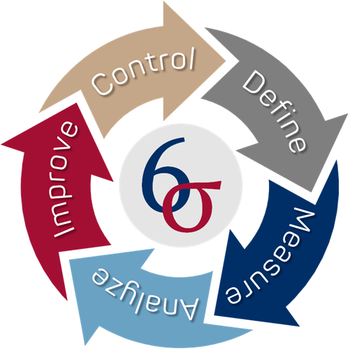</div>

Este trabajo pretende dar una breve introducción a los métodos del paquete **QualityTools**. Este paquete se implementó con fines didácticos para servir como una "Caja de Herramientas" (Six-Sigma) y contiene métodos asociados con el ciclo de resolución con la metodología de: "Definir, Medir, Analizar, Mejorar y Controlar" (con sus siglas en inglés DMAIC). 

El uso de estos métodos se ilustran con ayuda de conjuntos de datos creados artificalmente, a continuación se explica, el objetivo de cada una de las fases de este ciclo:

* **Definir**: Describir el problema y sus consecuencias (financieras), es la etapa fundamental para delimitar el problema. Los diagramas de flujo. Los diagramas de flujo de procesos identifican elementos cruciales del proceso (es decir, actividades), las técnicas de creatividad como Brainwriting y Brainstorming, así como la técnica SIPOC4, deberían conducir, dependiendo
del tamaño futuro del proyecto, a posiblemente una carta del proyecto.

* **Medir**: Elaborar un plan razonable para recopilar los datos requeridos y asegurarse de que los sistemas de medición sean capaces (es decir, ningún sesgo o sesgo conocido y la menor variación inmanente del sistema que
contribuya a las mediciones como sea posible). Dentro de esta fase se proporciona una descripción de la situación con la ayuda de índices de capacidad de proceso o de medición (MSA5 Tipo I) o un Gage R&R (MSA Tipo II)

* **Analizar**: Intente encontrar las causas fundamentales del problema utilizando varios métodos estadísticos, como histogramas, regresión, correlación, identificación de distribución, análisis de varianza y gráficos multivariados.

* **Mejorar**: Utiliza experimentos diseñados, es decir, factoriales completos y fraccionarios, diseños de superficies de respuesta, diseños de mezclas, diseños de taguchi y el concepto de deseabilidad para encontrar
configuraciones o soluciones óptimas para un problema.

* **Controlar**: Una vez que se logró una mejora, es necesario asegurarla, lo que significa que se deben implementar acuerdos para garantizar el nivel de mejora. El uso de control estadístico de procesos (es decir, gráficos de control de calidad) se puede utilizar para monitorear el comportamiento de un proceso

# Fase 1: Definir

La mayoría de las técnicas utilizadas en esta fase no están relacionadas con el uso sustancial de métodos estadísticos. Su objetivo es captar los conocimientos e ideas sobre el proceso involucrado, establecer un objetivo común y definir cómo cada parte contribuye a la solución.

Una técnica de visualización clásica que se utiliza en esta fase y está disponible en el paquete QualityTools es el **Diagrama de Pareto**, que nos ayuda a separar las pocas causas vitales de las muchas causas triviales.

Por ejemplo, en la causa más frecuente de un producto defectuoso, el diagrama de Pareto nos ayuda a visualizar cuánto contribuye una causa a un problema. Supongamos que una empresa está investigando unidades (productos) que no cumplen. 120 unidades fueron investigadas y se encontraron 6 tipos diferentes de defectos (datos cualitativos). Los defectos son denominados de A a F por fines prácticos.

```{r fig.show='asis', results='hide', fig.align='center', fig.width=8}
defectos = c(rep("E",62),rep("B",15),rep("F",3),rep("A",10),rep("C",20),rep("D",10))
paretoChart(defectos)
```

En este diagrama de Pareto podría transmitir el mensaje de que para resolver el $68\%$ de los problemas, el $33 \%$ de las causas (menos vitales) necesitan ser objeto de investigación.

Además de este uso, los diagramas de Pareto también se utilizan para visualizar los tamaños de efectos de los diferentes factores para los experimentos diseñados, a continución se muestra un ejemplo de una gráfica de errores de medición.

<center>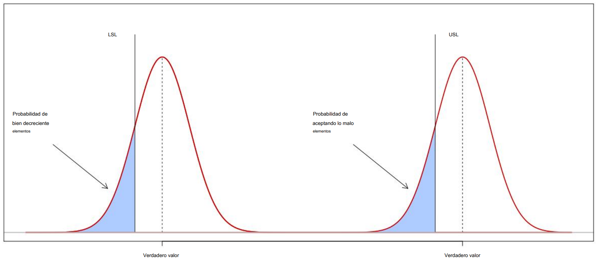</center>

# Fase 2: Medir

La recopilación de datos implica el uso de sistemas de medición a menudo denominados calibres. Para hacer una declaración sobre la calidad, el sistema de medición utilizado debe ser validado, y por lo tanto la variación para repetidas mediciones de la misma unidad debe ser tolerable, y por supuesto, debe depender del número de categorías distintivas qque necesita para poder identificar y caracterizar el producto. 

Esta cantidad tolerable de variación para un sistema de medición se relaciona directamente al rango de tolerancia de las características de un producto.  La capacidad de un sistema de mediciones es crucial para cualquier conclusión basada en datos y está directamente relacionada con los costos que implican los errores tipo I y tipo II.

## Capacidad de calibre - MSA Tipo I

Supongamos que un ingeniero quiere comprobar la capacidad de un dispositivo de medición óptico. Una unidad con característica conocida ($x_m = 10.033mm$) se mide repetidamente $n=25$ veces. De los valores de medición se obtiene la media $\bar{x_g}$ y la desviación estándar $s_g$.

Basicamente el cálculo de un índice de capacidad comprende dos pasos: primero se calcula una fracción del ancho de toletancia (es decir, $USL - LSL$), la fracción típicamente se relaciona a $0.2$. En un segundo paso esta fracción se relaciona con una medida de la dispersión del proceso (es decir, el rango en el que el $95,5\%$, o el $99.73\%$ de las características de un proceso son esperados).

Para valores de medición distribuidos normalmentem esto se relaciona con $k = 2 \sigma_g$ y $k = 3 \sigma_g$ calculados a partir de llos valores de medición; y para datos que no están distribuidos normalmente, se pueden tomar los cuantiles correspondientes. Si no hay sesgo, este cálculo representa el índice de capacidad $c_g$ y refleja la verdadera capacidad del dispositivo de medición.

$$
\begin{aligned}
c_g &= \frac{0.2 \cdot (USL - LSL)}{6 \cdot s_g} \\
    &= \frac{0.2 \cdot (USL - LSL)}{X_{0.99865} - X_{0.00135}}  
\end{aligned}
$$

Sin embargo, si hay un sesgom se tiene en cuenta al restarlo del numerador, en este caso, $c_g$ refleja solo la capacidad potencial (es decir, la capacidad si se corrige el sesgo), y $c_{gk}$  es un estimador de la capacidad real. El sesgo se calcula como la diferencia entre la característica conocida $x_m$ y la media de los valoes de medición $x_g$.

$$
c_{gk} = \frac{0.1 \cdot (USL - LSL) - |x_m - x_g|}{3 \cdot s_g}
$$

Determinar si el sesgo se debe al azar o no, se puede hacer con la ayuda de una prueba t que tiene la forma general siguiente:

$$
t = \frac{diferencia de medias}{error estandar de la diferencia} = \frac{Dif}{s_{Dif}/\sqrt{n}}
$$

Además del sesgo y la desviación estándar, es importante comprobar el diagrama de ejecución de los valores de medición. Usando el paquete QualityTools, todo esto se logra fácilmente usando el método `cg`, su resultado se muestra a continuación:

```{r, error=TRUE, message=FALSE, warning=FALSE, fig.align='center', fig.height=6.5, fig.width=8}
library(qualityTools)

x <- c ( 9.991, 10.013, 10.001, 10.007, 10.010, 10.013, 10.008, 10.017, 10.005, 10.005, 10.002,
        10.017, 10.005, 10.002, 9.996, 10.011, 10.009 , 10.006, 10.008, 10.003, 10.002, 10.006, 
        10.010, 9.992, 10.013)

cg(x, target = 10.003, tolerance = c(9.903, 10.103))
```

## Repetibilidad y reproducibidad del calibre - MSA Tipo II

Un procedimineto común aplicado en la industria es realizar un análisis *Gage R&R* para evaluar la repetibilidad y reproducibilidad de un sistema de medición ('R&R' significa repetibilidad y reproducibilidad).

La repetibilidad se refiere a la precisión de un sistema de medición, es decir, a la desviación estándar de mediciones posteriores de la misma unidad. miestras que reproducibilidad es la parte de la varianza general que modela el efecto de diferentes, por ejemplo, operadores que realizan mediciones en la misma unidad y  una posible interacción entre diferentes operadores y piezas medidas dentro de este "Gage R&R", el modelo general está dado por:

$$
\sigma^2_{total} = \sigma^2_{Piezas} + \sigma^2_{Operadores}  + \sigma^2_{Piezas \times Operador} + \sigma^2_{Error} 
$$

Donde:

* $\sigma^2_{Piezas}$: modela la variación entre diferentes unidades de un mismo proceso, por lo tanto, $\sigma$ es una estimación de la variabilidad inherente del proceso.

* $\sigma^2_{Operador}  + \sigma^2_{Piezas \times Operador} $: modela la reproducibilidad.

* $\sigma^2_{Error}$: modela la repetibilidad.

Ahora, supongamos que 3 operadores elegidos al azar midieron 10 unidades elegidas al azar. Cada operador midió cada unidad dos veces en un orden elegido al azar y las unidades no puedes distingirse entre si.

El *Diseño R&R del Calibre* correspondiente se puede crear utilizando el método `gageRRDesign` del paquete QualityTools, y las medidas se asignan a este diseño utilizando el método de respuesta, dados por `gageRR` y `plot`.

```{r, include=FALSE}
# Funcion gageRR Corregida

gageRR_abc <- function (gdo, method = "crossed", sigma = 6, alpha = 0.25, DM = NULL, 
          HM = NULL, tolerance = NULL, dig = 3, ...) 
{
  if (method %in% c("crossed", "nested")) 
    method = method
  else method = gdo@method
  yName = names(gdo)[5]
  aName = names(gdo)[3]
  bName = names(gdo)[4]
  if (method == "crossed") 
    abName = paste(aName, ":", bName, sep = "")
  if (method == "nested") 
    abName = paste(bName, "(", aName, ")", sep = "")
  bTobName = paste(bName, "to", bName, sep = " ")
  a = gdo@X[, aName]
  b = gdo@X[, bName]
  y = gdo@X[, yName]
  nestedFormula = as.formula(paste(yName, "~", aName, "/", 
                                   bName))
  crossedFormula = as.formula(paste(yName, "~", aName, "*", 
                                    bName))
  reducedFormula = as.formula(paste(yName, "~", aName, "+", 
                                    bName))
  if (!is.null(tolerance)) 
    tolerance(gdo) = tolerance
  if (anyNA(y) || !is.numeric(y)) 
    stop("Measurements need to be numeric")
  if (method == "nested") {
    numA <- nlevels(a[, drop = T])
    numB <- nlevels(b[, drop = T])
    numMPP <- length(y)/((numB) * numA)
    gdo@numO = numA
    gdo@numP = numB
    gdo@numM = numMPP
    fit = aov(nestedFormula, data = gdo)
    meanSq <- anova(fit)[, 3]
    gdo@ANOVA = fit
    gdo@method = "nested"
    MSa = meanSq[1]
    MSab = meanSq[2]
    MSe = meanSq[3]
    Cerror = MSe
    Cb = (MSab - MSe)/numMPP
    Ca = (MSa - MSab)/(numB * numMPP)
    if (Ca <= 0) 
      Ca = 0
    if (Cb <= 0) 
      Cb = 0
    Cab = 0
    totalRR = Ca + Cab + Cerror
    repeatability = Cerror
    reproducibility = Ca
    bTob = Cb
    totalVar = Cb + Ca + Cab + Cerror
    estimates = list(Cb = Cb, Ca = Ca, Cab = Cab, Cerror = Cerror)
    varcomp = list(totalRR = totalRR, repeatability = repeatability, 
                   reproducibility = reproducibility, bTob = bTob, totalVar = totalVar)
    gdo@Estimates = estimates
    gdo@Varcomp = varcomp
  }
  if (method == "crossed") {
    numA <- nlevels(a[, drop = T])
    numB <- nlevels(b[, drop = T])
    numMPP <- length(a)/(numA * numB)
    gdo@numO = numA
    gdo@numP = numB
    gdo@numM = numMPP
    fit = aov(crossedFormula, data = gdo)
    model <- anova(fit)
    gdo@ANOVA = fit
    gdo@method = "crossed"
    MSb = MSa = MSab = MSe = 0
    if (bName %in% row.names(model)) 
      MSb = model[bName, "Mean Sq"]
    else warning(paste("missing factor", bName, "in model"))
    if (aName %in% row.names(model)) 
      MSa = model[aName, "Mean Sq"]
    else warning(paste("missing factor", aName, "in model"))
    if (abName %in% row.names(model)) 
      MSab = model[abName, "Mean Sq"]
    else warning(paste("missing interaction", abName, "in model"))
    if ("Residuals" %in% row.names(model)) 
      MSe = model["Residuals", "Mean Sq"]
    else warning("missing Residuals in model")
    Cb = Ca = Cab = Cerror = 0
    Cb = (MSb - MSab)/(numA * numMPP)
    Ca = (MSa - MSab)/(numB * numMPP)
    Cab = (MSab - MSe)/(numMPP)
    Cerror = (MSe)
    gdo@RedANOVA = gdo@ANOVA
    if ((Cab < 0) || (model[abName, "Pr(>F)"] >= alpha)) {
      redFit <- aov(reducedFormula, data = gdo)
      model <- anova(redFit)
      MSb = MSa = MSab = MSe = 0
      if (bName %in% row.names(model)) 
        MSb = model[bName, "Mean Sq"]
      else warning(paste("missing factor", bName, "in model"))
      if (aName %in% row.names(model)) 
        MSa = model[aName, "Mean Sq"]
      else warning(paste("missing factor", aName, "in model"))
      if ("Residuals" %in% row.names(model)) 
        MSe = model["Residuals", "Mean Sq"]
      else warning("missing Residuals in model")
      Cb = Ca = Cab = Cerror = 0
      Cb = (MSb - MSe)/(numA * numMPP)
      Ca = (MSa - MSe)/(numB * numMPP)
      Cab = 0
      Cerror = (MSe)
      gdo@RedANOVA = redFit
    }
    gdo@method = "crossed"
    Ca = max(0, Ca)
    Cb = max(0, Cb)
    Cab = max(0, Cab)
    totalRR = Ca + Cab + Cerror
    repeatability = Cerror
    reproducibility = Ca + Cab
    bTob = max(0, Cb)
    totalVar = Cb + Ca + Cab + Cerror
    estimates = list(Cb = Cb, Ca = Ca, Cab = Cab, Cerror = Cerror)
    varcomp = list(totalRR = totalRR, repeatability = repeatability, 
                   reproducibility = reproducibility, a = Ca, a_b = Cab, 
                   bTob = bTob, totalVar = totalVar)
    gdo@Estimates = estimates
    gdo@Varcomp = varcomp
  }
  cat("\n")
  cat(paste("AnOVa Table - ", gdo@method, "Design\n"))
  print(summary(gdo@ANOVA))
  cat("\n")
  cat("----------\n")
  if (!identical(gdo@RedANOVA, gdo@ANOVA) && gdo@method == 
      "crossed") {
    cat(paste("AnOVa Table Without Interaction - ", gdo@method, 
              "Design\n"))
    print(summary(gdo@RedANOVA))
    cat("\n")
    cat("----------\n")
  }
  Source = names(gdo@Varcomp)
  Source[Source == "repeatability"] = " repeatability"
  Source[Source == "reproducibility"] = " reproducibility"
  Source[Source == "a_b"] = paste("  ", abName)
  Source[Source == "a"] = paste("  ", aName)
  Source[Source == "bTob"] = bTobName
  VarComp = round(as.numeric(gdo@Varcomp[c(1:length(gdo@Varcomp))]), 
                  3)
  Contribution = round(as.numeric(gdo@Varcomp[c(1:length(gdo@Varcomp))])/as.numeric(gdo@Varcomp[length(gdo@Varcomp)]), 
                       3)
  VarComp = t(data.frame(gdo@Varcomp))
  VarCompContrib = VarComp/gdo@Varcomp$totalVar
  Stdev = sqrt(VarComp)
  StudyVar = Stdev * gdo@Sigma
  StudyVarContrib = StudyVar/StudyVar["totalVar", ]
  SNR = 1
  ptRatio = NULL
  temp = NULL
  if ((length(gdo@GageTolerance) > 0) && (gdo@GageTolerance > 
                                          0)) {
    ptRatio = StudyVar/gdo@GageTolerance
    temp = data.frame(VarComp, VarCompContrib, Stdev, StudyVar, 
                      StudyVarContrib, ptRatio)
    names(temp)[6] = c("P/T Ratio")
    row.names(temp) = c(Source)
  }
  else {
    temp = data.frame(VarComp, VarCompContrib, Stdev, StudyVar, 
                      StudyVarContrib)
    row.names(temp) = c(Source)
  }
  cat("\n")
  cat("Gage R&R\n")
  tempout = temp
  print(format(tempout, digits = dig))
  cat("\n")
  cat("---\n")
  cat(" * Contrib equals Contribution in %\n")
  SNRTemp = sqrt(2) * (temp[bTobName, "Stdev"]/temp["totalRR", 
                                                    "Stdev"])
  if (SNRTemp > 1) 
    SNR = SNRTemp
  cat(paste(" **Number of Distinct Categories (truncated signal-to-noise-ratio) =", 
            floor(SNR), "\n"))
  cat("\n")
  invisible(gdo)
}


```


```{r}
library(qualityTools)

# Crear un diseño R&R de Calibre
dis <- gageRRDesign(Operators = 3, Parts = 10, Measurements = 2, randomize = FALSE)

# Establecemos las respuestas de medición
response(dis) <-  c(23, 22, 22, 22, 22, 25, 23, 22, 23, 22, 20, 22, 22, 22, 24, 25, 27, 28, 23, 24, 23, 24, 24, 22, 22, 22, 24, 23, 22, 24, 20, 20, 25, 24, 22, 24, 21, 20, 21, 22, 21, 22, 21, 21, 24, 27,  25, 27, 23, 22, 25, 23, 23, 22, 22, 23, 25, 21, 24, 23)

# Realizamos Gage R&R
gdo <- gageRR_abc(dis)
```


```{r, fig.align='center', fig.width=7, fig.height=8}
# Visualización de Gage R&R
plot(gdo)
```

El diagrama de barras ofrece una representación visual de los componentes de la varianza. `totalRR` representa la repetibilidad y reproducibilidad totales. El $48\%$ de la variación se debe al $35\%$ de *repitibilidad*, es decir, variación del propio calibre, y al $13\%$ de reproducibilidad, es decir, efecto del operador y la interación entre el operador y la pieza.

Se puede ver en la tabla Anova que no existe interacción entre piezas y operadores. El $52\%$ de la variación (columna **VarCompContrib**) se debe a diferencias entre las partes tomadas del proceso (variación inherente), que se puede ver en el gráfico **Measurement by Part**. La variación de las mediciones tomadas por un operador es aproximadamente igual para los tres operadores (**Measurement by Operator**), aunque el operador C parece producir valores que la mayoría de las veces son mayores que los valores de los otros operadores (**Interaction Operator: Part**).

Además de esta interpretación de los resultados, en la industria se utilizan valores críticos para **totalRR**, también denominado en la industria como "GRR". Sin embargo, un sistema de medición nunca debe juzgarse únicamente por sus valores críticos.

| Contribución total RR | Capacidad      |
|-----------------------|----------------|
|        ≤ 0.1          | Adecuada       |
|     < 0.1 y < 0.3     | Adecuada con limitaciones dependiendo de las circunstancias |
|        ≥ 0.3          | No adecuada    |

* **Verificación de interacción: ** El gráfico de interacción proporciona una verificación visual de posibles interacciones entre el Operador y la Pieza. Para cada operador se muestra el valor medio de la
medición en función del número de pieza. Las líneas cruzadas indican que los operadores están asignando lecturas diferentes a idénticas dependiendo de la combinación de Operador y Pieza. 
Diferentes lecturas significan, en el caso de una interacción entre Operador y Pieza, que en promedio a veces se asignan valores más pequeños o más grandes dependiendo de la combinación de Operador y Pieza. En este caso, las líneas prácticamente no se cruzan, pero el operador C parece asignar sistemáticamente lecturas mayores a las piezas que sus colegas.

* **Operadores:** Para comprobar si hay un efecto dependiente del operador, las mediciones se trazan agrupadas por operadores en forma de diagramas de caja. Los diagramas de caja que difieren en tamaño o ubicación pueden indicar, por ejemplo, posibles procedimientos diferentes dentro del proceso de medición, que luego conducen a una diferencia sistemática en las lecturas. En nuestro ejemplo se podría discutir un posible efecto para el operador C que también está respaldado por el gráfico de interacción.

* **Variación inherente del proceso:** Dentro de este gráfico las mediciones están agrupadas por operador. Gracias a las mediciones repetidas realizadas por diferentes operadores por pieza, se obtiene
una idea del proceso. Una línea que conecta la media de las mediciones de cada parte proporciona una idea de la variación inherente del proceso. Cada pieza se mide el número de operadores multiplicado por el número de mediciones por pieza.

* **Componentes de Variación:** Para comprender el resultado de un estudio de Gage R&R se debe hacer referencia a la fórmula presentada al inicio de esta sección. El componente de varianza `totalRR` (columna `VarComp`) representa la repetibilidad y reproducibilidad total. Dado que las varianzas simplemente se suman, se tiene que $1.664$ es la suma de $1.209$ (repetibilidad dada por $\sigma^2_{Error}$) y $0.455$ (reproducibilidad) que es la suma de Operador ($\sigma^2_{Operador}$) y Operador:Parte ($\sigma^2_{Partes \times Operador}$).

Como no hay interacción, la reproducibilidad asciende a $0.455$. *Parte a Parte* asciende a $1.781$. Junto con el total de repetibilidad y reproducibilidad, esto da $\sigma^2_{Total} = 3.446$.


# Fase 3: Analizar

## Capacidad del Proceso

Además de la capacidad de un sistema de medición, a menudo la capacidad de un proceso es de interés o necesidad que debe evaluarse, por ejemplo, como parte de una relación entre proveedor y cliente en la industria. 

Los índices de capacidad del proceso básicamente indican cuánto del rango de tolerancia está siendo utilizado por la variación debida a causas comunes del proceso considerado. Utilizando estas técnicas, se puede determinar cuántas unidades (por ejemplo, productos) se espera que caigan fuera del rango de tolerancia, es decir, defectuoso con respecto a los requisitos determinados. También proporciona información sobre dónde centrar el proceso si el desplazamiento es posible y significativo en términos de costos.

$$
c_p = \frac{USL - LSL}{Q_{0.99865} - Q_{0.00135}}
$$

$$
c_{pkL} = \frac{Q_{0.5} - LSL}{Q_{0.5} - Q_{0.00135}}
$$
$$
c_{pkU} = \frac{USL - Q_{0.5}}{Q_{0.99865} - Q_{0.5}}
$$
* $c_p$: Es la capacidad potencial del proceso que podría lograrse si el proceso se pudiera centrar dentro de los límites de especificación.

* $c_{pk}$: Es la capacidad real del proceso que incorpora la ubicación de la distribución (es decir, el centro) de la característica dentro de los límites de especificación.

Para límites de especificación unilaterales, existen $c_{pkL}$ y $c_{pkU}$, siendo $c_{pk}$ igual al índice de capacidad más pequeño. Como se puede imaginar, además de la ubicación de la distribución de la característica, la forma de la distribución también es relevante. Evaluar el ajuste de una distribución específica para datos dados se puede hacer a través de gráficos de probabilidad (ppPlot) y gráficos de cuantiles-cuantiles (qqPlot), así como métodos de prueba formales como la Prueba de Anderson-Darling.


Las capacidades del proceso pueden calcularse con el método **pcr** del paquete qualityTools. El método pcr traza un histograma de los datos, la distribución ajustada y devuelve los índices de capacidad junto con los parámetros estimados de la distribución, una Prueba de Anderson-Darling para la distribución especificada y el correspondiente QQ-Plot.

```{r, include=FALSE, warning=FALSE, message=FALSE}
library(qualityTools)
```

**Ejemplos:**

1. Distribución Normal

```{r, error=TRUE, fig.align='center', fig.height=6, collapse=TRUE, results = 'hide'}
set.seed(1234)
datos <- rnorm(20, mean = 20)
pcr(datos, "normal", lsl = 17, usl = 23)
```


2. Distribución Weibull

```{r,error=TRUE, fig.align='center', fig.height=6, collapse=TRUE, results = 'hide'}
set.seed(1234)
weib <- rweibull(20, shape = 2, scale = 8)
pcr(weib, "weibull", usl = 20)
```

Junto con la representación gráfica se presenta un Test de Anderson Darling y se devuelve la distribución 

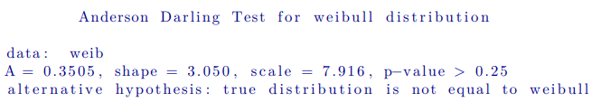

Los gráficos QQ-plot pueden obtenerse a partir del paquete QualityTools, de la siguiente forma:

```{r, fig.align='center', fig.height=4, results = 'hide'}
par(mfrow = c(1,2))
qqPlot(weib, "weibull"); qqPlot(datos, "normal")
```

Y los gráficos de probabilidad se pueden calcular con la función ppPlot del mismo paquete, de la siguiente manera:

```{r, fig.align='center', fig.height=4, results = 'hide'}
par(mfrow = c(1,2))
ppPlot(weib, "weibull"); ppPlot(datos, "normal")
```


# Fase 4: Mejorar

## Diseños factoriales $2^{k}$

El método `facDesign` diseña un modelo de *k* factores y 2 combinaciones por factor, el cual es llamado $2^k$.

Supondremos un ejemplo de un proceso que tiene 5 factores A, B, C, D y E, de los cuales tres se consideran relevantes para el rendimiento del proceso (A, B y C).


```{r eval=FALSE}
set.seed(1234)
dfac <- facDesign(k = 3, centerCube = 4)
names(dfac) <- c('Facto 1', 'Factor 2', 'Factor 3')
lows(df) <- c(80,120,1)
highs(fdo) <- c(120,140,2)
summary(dfac)
```
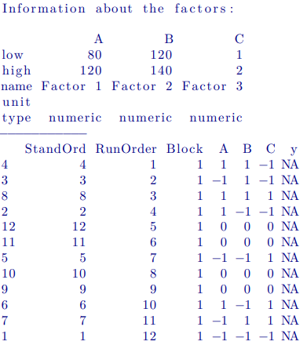{width=260}


El proceso se simula con el método `simProc`:

```{r}
#Primeros valores
rend <- simProc(x1=120,x2=140,x3=2)
#valores completos
rend = c(simProc(120,140,1),simProc(80,140,1),simProc(120,140,2),simProc(120,120,1),simProc(90,130,1.5),simProc(90,130,1.5),simProc(80,120,2),simProc(90,130,1.5),simProc(90,130,1.5),simProc(120,120,2),simProc(80,140,2),simProc(80,120,1))
```

Se asigna el rendimiento al diseño factorial:

```{r eval=FALSE}
response(dfac) <- rend
```

Para el análisis del diseño se puede usar los métodos `effectPlot`, `interactionPlot`, `lm`, `wirePlot`, `contourPlot`.

```{r eval=FALSE}
effectPlot(dfac, classic = TRUE)
```
<div style="text-align:center">
  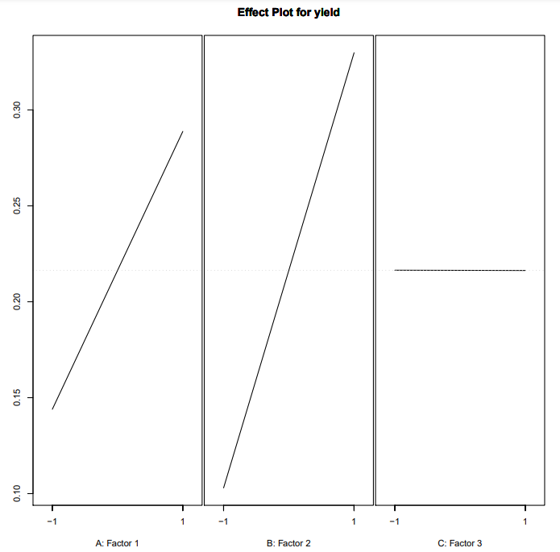
</div>


```{r eval=FALSE}
interactionPlot(dfac)
```
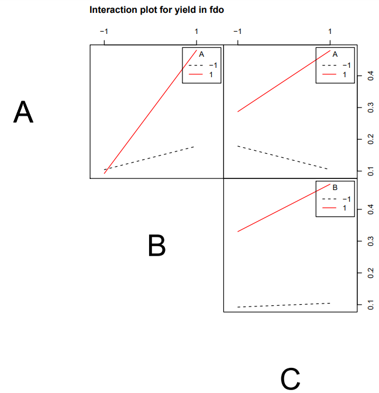{width=500}

Se puede usar el método de R `lm`, vemos a continuación:

```{r eval=FALSE}
m1 <- lm(rend ~ A*B*C, data=dfac)
summary(m1)
```
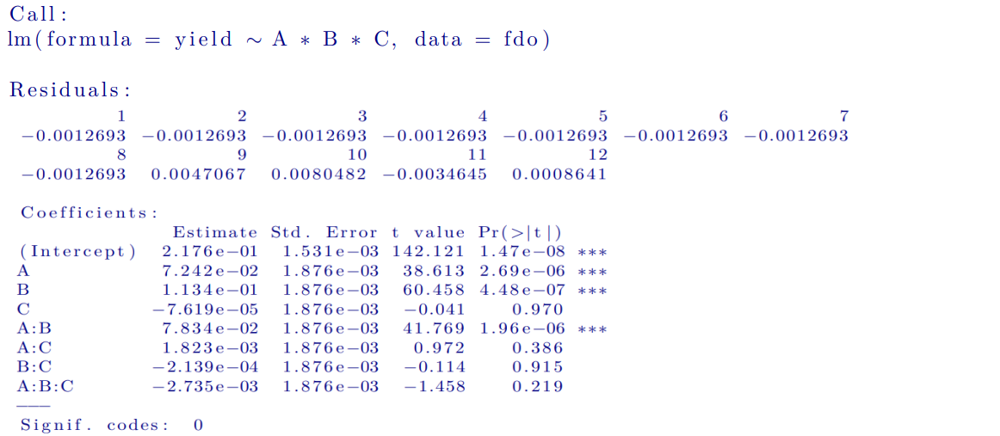{width=600}

Se puede que ver que A, B y AB son significativos. 

También se puede obtener dos gráficas mediante `paretoPlot` y `normalPlot` del mismo paquete qualityTools.

```{r eval=FALSE}
par(mfrow=c(1,2))
paretoPlot(dfac)
normalPlot(dfac)
```

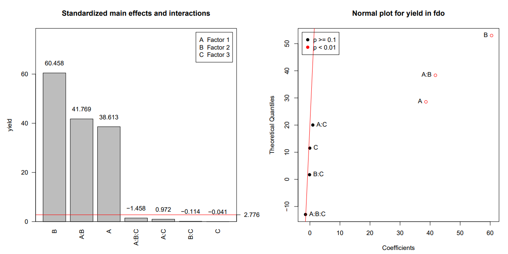{width=700}

La relación entre el factor A y el B se puede visualizar mediante una representación 3D mediante `wirePlot` y `contourPlot`

```{r eval=FALSE}
par(mfrow=c(1,2))
wirePlot(A,B,rend,data=dfac)
contourPlot(A,B,rend,data=dfac)
```
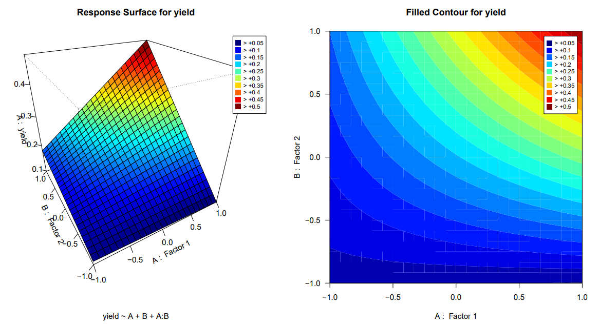{width=700}

## Diseños factoriales fraccionarios $2^{k-p}$

Este diseño tiene $k$ factores y se prueba en $2k-p$ ejecuciones, por ejemplo para un diseño $2^{5-1}$ se prueban cinco factores en 24 ejecuciones. 

Para realizar esto se utiliza el método `fracDesign`, vamos a realizar el ejemplo de un diseño $2^{3-1}$, para ello se debe utilizar el argumento `gen='C=AB'`, lo cual quiere decir que el efecto de C es equivalente al de AB:

```{r eval=FALSE}
dfacfrac <- fracDesign(k=3,gen='C=AB',centerCube = 4)
```

Se puede obtener información específica del diseño mediante `summary`:

```{r eval=FALSE}
summary(dfacfrac)
```
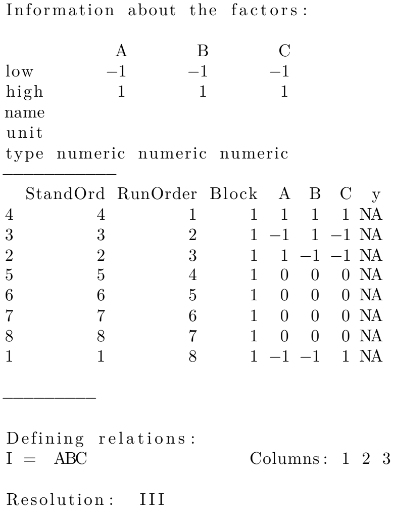{width=270}

Vemos que en el modelo se muestra que `I=ABC` y por lo tanto se cumplen las siguientes reglas:

\begin{align}
I\times A&=A\\
A\times A&=I\\
A\times B&=B\times A
\end{align}

Para encontrar todos los efectos equivalentes se puede usar los comandos:

```{r eval=FALSE}
aliasTable(dfacfrac)
```
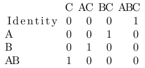{width=130}

```{r eval=FALSE}
confounds(dfacfrac)
```
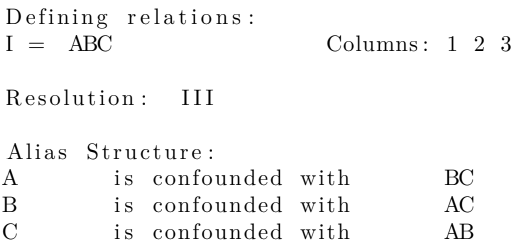{width=270}

Estos diseños se pueden generar asignando los generadores apropiados, el cual se puede elegir entre tabla predefinidas usando el método `fracChoose` y seleccionando el diseño deseado:

```{r eval=FALSE}
fracChoose()
```
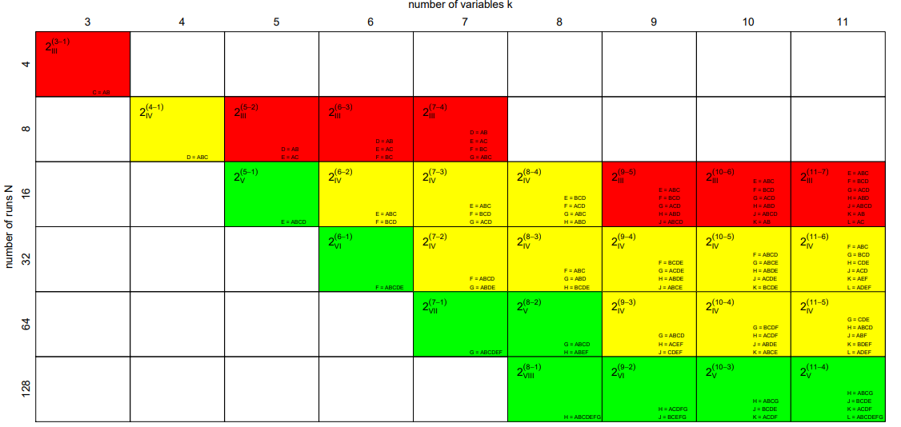{width=700}

## Diseños replicados y puntos centrales

Se puede crear un diseño replicado con puntos centrales adicionales usando `replicates` y `centerCube`:

```{r eval=FALSE}
dfac1 <- facDesign(k = 3, centerCube = 2, replicates = 2)
```
## Respuestas múltiples

Se puede agregar vectores de respuesta al diseño con el método `response`. Por ejemplo, se crea una segunda respuesta `y2` que se llena con números aleatorios y se agrega al objeto creado.

```{r eval=FALSE}
set.seed(1234)
y2 <- rnorm(12,mean=120)
response(dfac) <- data.frame(yield,y2)
```

Se puede visualizar en 3D con los métodos `wirePlot` y `contourPlot` especificando con `form`:

```{r eval=FALSE}
par(mforw = c(1,2))
wirePlot(A, B, yield, data = dfac, form = "yield~A+B+C+A*B")
contourPlot(A, B, y2, data = fdo, form = "y2~A+B+C+A*B")
```
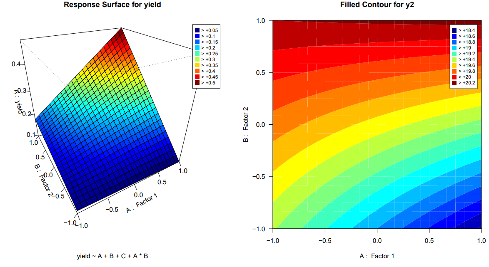{width=700}

Se puede crear los gráficos con el tercer factor C en -1 y $C=1$, de la forma:

```{r eval=FALSE}
par(mfrow = c(1,2))
wirePlot(A, B, y2, data = dfrac, factors = list(C=-1), form = "y2~A*B*C")
wirePlot(A, B, y2, data = dfrac, factors = list(C=1), form = "y2∼A∗B∗C")
```

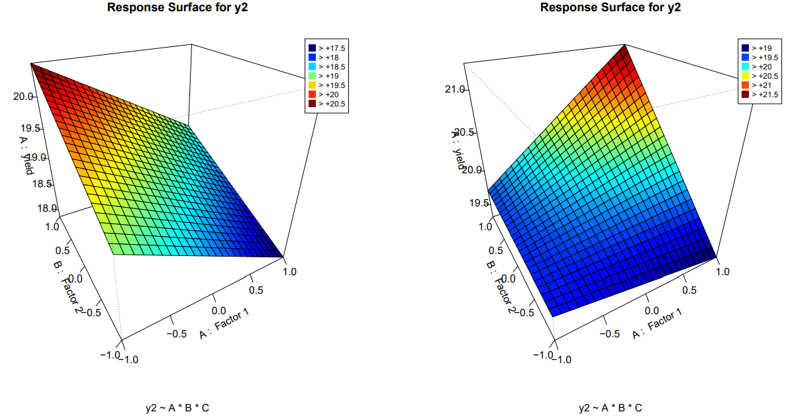{width=700}

Si no se proporciona ninguna fórmula explícitamente, los métodos predeterminados son el ajuste completo o el que está almacenado en el objeto de diseño factorial. El almacenamiento del ajusto se puede realizar con el método `fits` y se utiliza cuando se trabaja con más de una respuesta. Además, se utiliza `lm` para analizar el diseño factorial fraccionario.

```{r eval=FALSE}
fits(fdo) <- lm(yield∼A+B, data = fdo)
fits(fdo) <- lm(y2∼A∗B∗C, data = fdo)
fits(fdo)
```
{width=500}

## Pasar a un entorno de proceso con un mayor rendimiento esperado

Como el proceso puede ser modelado por una relación lineal se puede determinar un alto rendimiento fácilmente, esto se puede calcular gráficamente o utilizando el método `steepAscent`:

```{r eval=FALSE}
sao <- steepAscent(factors = c("A", "B"), response = "yield", data = dfac, steps = 20)
```
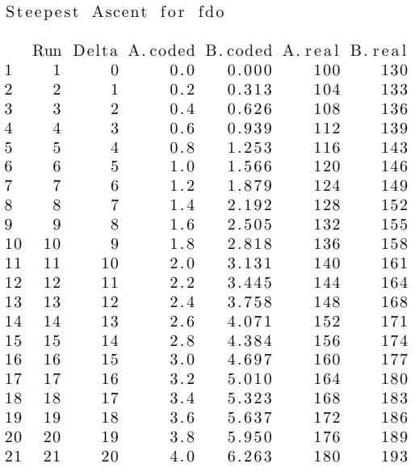{width=300}

```{r eval=FALSE}
sao
```
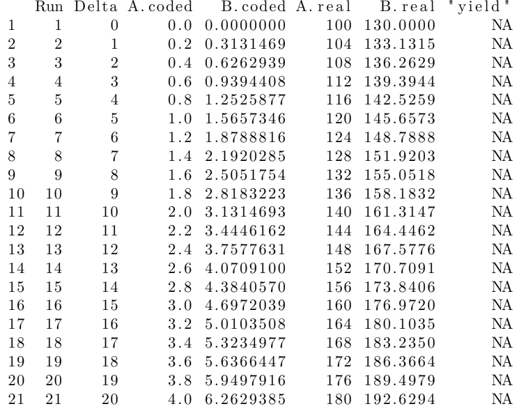{width=300}

Como se estableció los valores reales anteriormente con los métodos `highs` y `lows` son mostrados como valores reales. Los valores de respuesta de `sao` pueden ser establecidos con el método `response` y graficados con `plot`

```{r eval=FALSE}
predicted <- simProc(sao[,5], sao[,6])
responde(sao) <- predicted
plot(sao, type='b', col=2)
```

## Diseños de superficies de respuesta

Se debe tener en cuenta que  no todas las relaciones son lineales por lo cual  para detectar y modelizar las relaciones no lineales se necesitan más de dos combinaciones por factor. Para averiguar si un diseño de superficie de respuesta es necesario (es decir, un diseño con más de dos combinaciones por factor) se puede
comparar el valor esperado de la(s) variable(s) de respuesta con la(s) observada(s) utilizando
puntos centrales . Cuanto mayor sea la diferencia entre los valores
esperados, más improbable será que  esta diferencia sea el resultado de ruido aleatorio.
Bajo el contexto del ejercicio desarrollado en la sección de diseño factorial $2^{k}$ utilizamos el método **steepAscent** de qualityTools para pasar a una mejor región del proceso. El centro de la
nueva región de proceso está definido por 144 y 165 en valores reales la cual  es el inicio del nuevo diseño.

```{r eval=FALSE}
#Semilla
set.seed(1234)
fdo2 <- facDesign(k = 2, centerCube = 3)
names(fdo2) <- c("Factor1", "Factor2")
lows(fdo2) <- c(13, 4, 155)
highs(fdo2) <- c(15, 5, 175)
  
```
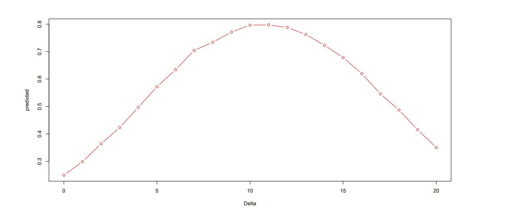{width=700}


el rendimiento se obtiene utilizando el `simProc` y se asigna al nuevo diseño con la
ayuda del método genérico de `response` del paquete **qualityTools**

```{r eval=FALSE}
rendimiento=c(simProc(134,175),simProc(144.5,165.5),simProc(155,155),simProc(144.5,165.5),simProc(155,175),simProc(144.5,165.5),simProc(134,155))
response(fdo2)=rendimiento
```
Si se observan los gráficos de residuos, se apreciará una diferencia sustancial entre los valores esperados
y los valores observados (podría realizarse una prueba de falta de ajuste para verificarlo).
Para llegar a un modelo que describa la relación hay que añadir más puntos
que se denominan la **starportion** del diseño de la superficie de respuesta.
La adición de la **starportion** se realiza fácilmente utilizando el método `starDesign` del paquete **qualityTools**
Por defecto, el valor de alfa se elige de forma que ambos criterios, ortogonalidad y
rotatabilidad se cumplan . Se llama al método starDesign en el objeto de diseño factorial
factorial `fdo2`. La llamada a `rsdo` le mostrará el diseño de superficie de respuesta resultante.Debe tener una porción cúbica que conste de 4 runs, 3 puntos centrales en la porción cúbica, 4
axiales y 3 puntos centrales en la porción de estrella (**starportion**).

```{r eval=FALSE}
rsdo= starDesign( data =fdo2 )
rsdo
```
| StandOrd | RunOrder | Block | A     | B     | rendimiento |
|----------|----------|-------|-------|-------|------------ |
| 3        | 3        | 1     | 1     | -1.000| 3769        |
| 7        | 7        | 2     | 1     | 0.000 | 7953        |
| 2        | 2        | 3     | 1     | -1.000| 7935        |
| 6        | 6        | 4     | 1     | 0.000 | 7865        |
| 4        | 4        | 5     | 1     | 1.000 | NA          |
| 5        | 5        | 6     | 1     | 0.000 | NA          |
| 1        | 1        | 7     | 1     | -1.000| NA          |
| 8        | 8        | 8     | 2     | -1.414| NA          |
| 9        | 9        | 9     | 2     | 1.000 | NA          |
| 10       | 10       | 10    | 2     | 0.000 | NA          |
| 11       | 11       | 11    | 2     | 0.000 | NA          |
| 12       | 12       | 12    | 2     | 0.000 | NA          |
| 13       | 13       | 13    | 2     | 0.000 | NA          |
| 14       | 14       | 14    | 2     | 0.000 | NA          |


Utilizando el método estrella del paquete **qualityTools** se pueden ensamblar fácilmente diseños
secuencialmente. Esta estrategia secuencial ahorra recursos pues, en comparación con empezar con
diseño de superficie de respuesta desde el principio, la parte en estrella sólo se ejecuta si es realmente necesaria. Los rendimientos del proceso siguen estando dados por el método `simProc`.

```{r eval=FALSE}

yield2 <- c(
  yield,
  simProc(130, 165),
  simProc(155, 165),
  simProc(144, 155),
  simProc(144, 179),
  simProc(144, 165),
  simProc(144, 165),
  simProc(144, 165)
)

response(rsdo) <- yield2

```

Se ajusta un modelo cuadrático completo utilizando el método **lm**

```{r eval=FALSE}
lm.3 <- lm(yield2 ~ A*B + I(A^2) + I(B^2), data = rsdo)

```
La superficie de respuesta puede visualizarse utilizando `wirePlot` y `contourPlot`.

```{r eval=FALSE}
par(mfrow = c(1, 2))
wirePlot(A, B, yield2, form = "yield2 ~ A*B + I(A^2) + I(B^2)", data = rsdo, theta = -70)
contourPlot(A, B, yield2, form = "yield2 ~ A*B + I(A^2) + I(B^2)", data = rsdo)

```

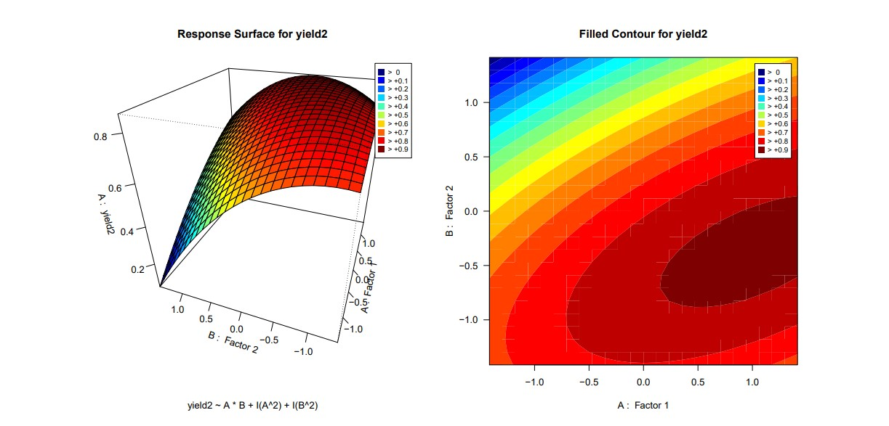{width=700}
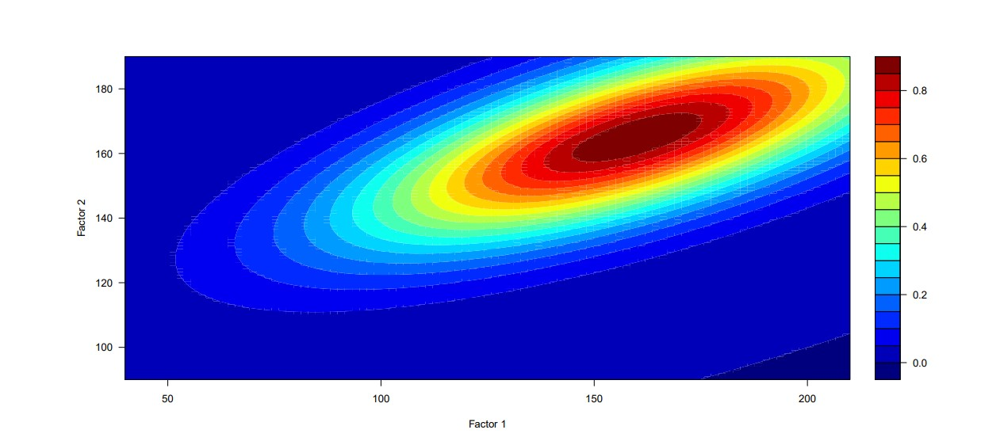{width=700}

Se compara los resultados de los diseños factorial y de superficie de respuesta con el proceso simulado.


Se pueden crear diseños de superficie de respuesta utilizando el método `rsmDesign`. Por ejemplo un diseño con alfa = 1.633, 0 puntos centrales en la parte del cubo y 6 puntos centrales en la parte de la estrella con:

```{r eval=FALSE}
fdo <- rsmDesign(k = 3, alpha = 1.633, cc = 0, cs = 6)

```
y el diseño se puede poner en orden estándar utilizando el método `randomize` con el argumento `so=TRUE` (es decir, orden estándar). `cc` significa centerCube y `cs` para centerStar.


```{r eval=FALSE}

fdo <- randomizeDesign(fdo, so = TRUE)

```


Los diseños de superficie de respuesta también pueden elegirse a partir de una tabla utilizando el método `rsmChoose`.

```{r eval=FALSE}
rsdo <- rsmDesign()
```

### Montaje secuencial de diseños de superficie de respuesta

El ensamblaje secuencial es una característica  importante de los diseños de superficie de respuesta. En función de de las características del diseño factorial (fraccional) puede aumentarse una porción de estrella utilizando el método `starDesign`. Una porción en estrella consta de recorridos axiales
y puntos centrales opcionales (`cs`) en la parte axial a diferencia de los puntos centrales (`cc`) en la parteparte cúbica.

```{r eval=FALSE}
fdo3 <- facDesign(k = 6)
rsdo <- starDesign(alpha = "orthogonal", data = fdo3)
```

En caso de que no se entregue ningún diseño factorial (fraccional)  al método `starDesign`, se devuelve una lista con `data.frames` que pueden asignarse al diseño factorial (fraccional) existente utilizando los métodos `star`, `centerStar` y `centerCube`.


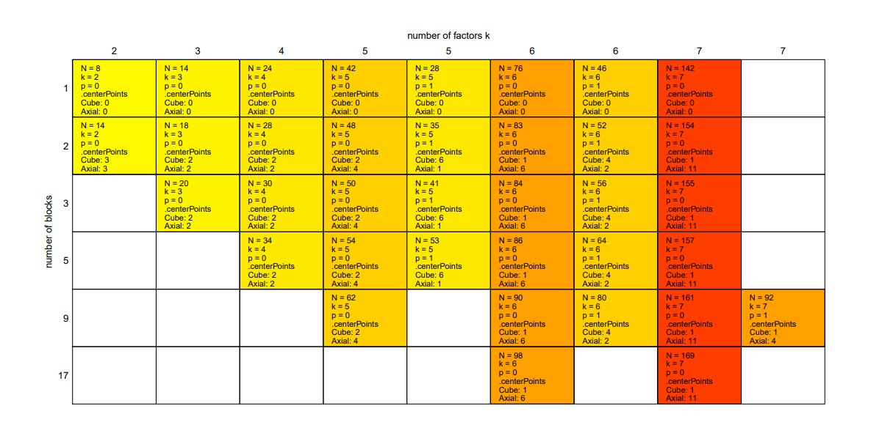{width=700}

### Aleatorización

La aleatorización se consigue utilizando el método `randomize`.
Es necesario suministrar una semilla aleatoria (random.seed) que es útil para tener el mismo orden de ejecución en cualquier máquina.

```{r eval=FALSE}
randomize(fdo, random.seed = 123)

```
El método `randomize`  se puede utilizar para obtener un diseño en orden estándar con la ayuda del argumento `so`.

```{r eval=FALSE}
randomizeDesign(fdo, so = TRUE)

```
### Bloqueo

El bloqueo es otra característica relevante y puede conseguirse mediante el método de `blocking`. Bloquear un diseño a posteriori no siempre tiene éxito.
Sin embargo, no es problemático durante el montaje secuencial.


# Bibliografía 

* Roth, T. (2016). Working with the qualityTools package.
* Six Sigma Daily (2012). What is DMAIC?. recuperado de: https://www.sixsigmadaily.com/what-is-dmaic/


