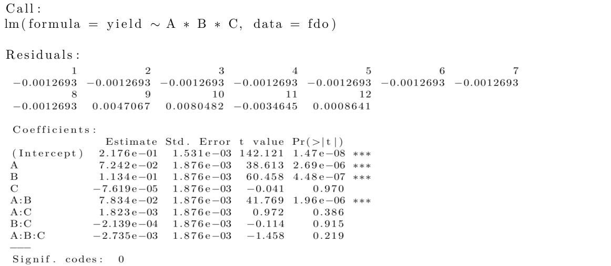

Link: https://cran.r-hub.io/web/packages/qualityTools/vignettes/qualityTools.pdf
1. Cap 1 a Cap 4
2. Cap 5.1 a 5.5
3. Cap 5.6 hasta cap 7
Puesto 1: Andrea
Puesto 2: Fabian
Puesto 3: Dario

```{r message=FALSE, warning=FALSE, include=FALSE}
library(qualityTools)
```

# Fase 4: Mejorar

## Diseños factoriales $2^{k}$

El método `facDesign` diseña un modelo de *k* factores y 2 combinaciones por factor, el cual es llamado $2^k$.

Supondremos un ejemplo de un proceso que tiene 5 factores A, B, C, D y E, de los cuales tres se consideran relevantes para el rendimiento del proceso (A, B y C).


```{r eval=FALSE}
set.seed(1)
dfac <- facDesign(k = 3, centerCube = 4)
names(dfac) <- c('Facto 1', 'Factor 2', 'Factor 3')
lows(df) <- c(80,120,1)
highs(fdo) <- c(120,140,2)
summary(dfac)
```
{width=260}


El proceso se simula con el método `simProc`:

```{r}
#Primeros valores
rend <- simProc(x1=120,x2=140,x3=2)
#valores completos
rend = c(simProc(120,140,1),simProc(80,140,1),simProc(120,140,2),simProc(120,120,1),simProc(90,130,1.5),simProc(90,130,1.5),simProc(80,120,2),simProc(90,130,1.5),simProc(90,130,1.5),simProc(120,120,2),simProc(80,140,2),simProc(80,120,1))
```

Se asigna el rendimiento al diseño factorial:

```{r eval=FALSE}
response(dfac) <- rend
```

Para el análisis del diseño se puede usar los métodos `effectPlot`, `interactionPlot`, `lm`, `wirePlot`, `contourPlot`.

```{r eval=FALSE}
effectPlot(dfac, classic = TRUE)
```
{width=500}

```{r eval=FALSE}
interactionPlot(dfac)
```
{width=500}

Se puede usar el método de R `lm`, vemos a continuación:

```{r eval=FALSE}
m1 <- lm(rend ~ A*B*C, data=dfac)
summary(m1)
```
{width=600}

Se puede que ver que A, B y AB son significativos. 

También se puede obtener dos gráficas mediante `paretoPlot` y `normalPlot` del mismo paquete qualityTools.

```{r eval=FALSE}
par(mfrow=c(1,2))
paretoPlot(dfac)
normalPlot(dfac)
```

{width=700}

La relación entre el factor A y el B se puede visualizar mediante una representación 3D mediante `wirePlot` y `contourPlot`

```{r eval=FALSE}
par(mfrow=c(1,2))
wirePlot(A,B,rend,data=dfac)
contourPlot(A,B,rend,data=dfac)
```
{width=700}

## Diseños factoriales fraccionarios $2^{k-p}$


