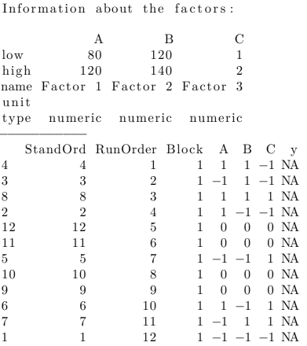

Link: https://cran.r-hub.io/web/packages/qualityTools/vignettes/qualityTools.pdf
1. Cap 1 a Cap 4
2. Cap 5.1 a 5.5
3. Cap 5.6 hasta cap 7
Puesto 1: Andrea
Puesto 2: Fabian
Puesto 3: Dario


```{r message=FALSE, warning=FALSE, include=FALSE}
library(qualityTools)
```


<div></div>

Este trabajo pretende dar una breve introducción a los métodos del paquete **QualityTools**. Este paquete se implementó con fines didácticos para servir como una "Caja de Herramientas" (Six-Sigma) y contiene métodos asociados con el ciclo de resolución con la metodología de: "Definir, Medir, Analizar, Mejorar y Controlar" (con sus siglas en inglés DMAIC). 

El uso de estos métodos se ilustran con ayuda de conjuntos de datos creados artificalmente, a continuación se explica, el objetivo de cada una de las fases de este ciclo:

* **Definir**: Describir el problema y sus consecuencias (financieras), es la etapa fundamental para delimitar el problema. Los diagramas de flujo. Los diagramas de flujo de procesos identifican elementos cruciales del proceso (es decir, actividades), las técnicas de creatividad como Brainwriting y Brainstorming, así como la técnica SIPOC4, deberían conducir, dependiendo
del tamaño futuro del proyecto, a posiblemente una carta del proyecto.

* **Medir**: Elaborar un plan razonable para recopilar los datos requeridos y asegurarse de que los sistemas de medición sean capaces (es decir, ningún sesgo o sesgo conocido y la menor variación inmanente del sistema que
contribuya a las mediciones como sea posible). Dentro de esta fase se proporciona una descripción de la situación con la ayuda de índices de capacidad de proceso o de medición (MSA5 Tipo I) o un Gage R&R (MSA Tipo II)

* **Analizar**: Intente encontrar las causas fundamentales del problema utilizando varios métodos estadísticos, como histogramas, regresión, correlación, identificación de distribución, análisis de varianza y gráficos multivariados.

* **Mejorar**: Utiliza experimentos diseñados, es decir, factoriales completos y fraccionarios, diseños de superficies de respuesta, diseños de mezclas, diseños de taguchi y el concepto de deseabilidad para encontrar
configuraciones o soluciones óptimas para un problema.

* **Controlar**: Una vez que se logró una mejora, es necesario asegurarla, lo que significa que se deben implementar acuerdos para garantizar el nivel de mejora. El uso de control estadístico de procesos (es decir, gráficos de control de calidad) se puede utilizar para monitorear el comportamiento de un proceso

# Fase 1: Definir

La mayoría de las técnicas utilizadas en esta fase no están relacionadas con el uso sustancial de métodos estadísticos. Su objetivo es captar los conocimientos e ideas sobre el proceso involucrado, establecer un objetivo común y definir cómo cada parte contribuye a la solución.

Una técnica de visualización clásica que se utiliza en esta fase y está disponible en el paquete QualityTools es el **Diagrama de Pareto**, que nos ayuda a separar las pocas causas vitales de las muchas causas triviales.

Por ejemplo, en la causa más frecuente de un producto defectuoso, el diagrama de Pareto nos ayuda a visualizar cuánto contribuye una causa a un problema. Supongamos que una empresa está investigando unidades (productos) que no cumplen. 120 unidades fueron investigadas y se encontraron 6 tipos diferentes de defectos (datos cualitativos). Los defectos son denominados de A a F por fines prácticos.

```{r fig.show='asis', results='hide', fig.align='center', fig.width=8}
defectos = c(rep("E",62),rep("B",15),rep("F",3),rep("A",10),rep("C",20),rep("D",10))
paretoChart(defectos)
```

En este diagrama de Pareto podría transmitir el mensaje de que para resolver el $68\%$ de los problemas, el $33 \%$ de las causas (menos vitales) necesitan ser objeto de investigación.

Además de este uso, los diagramas de Pareto también se utilizan para visualizar los tamaños de efectos de los diferentes factores para los experimentos diseñados, a continución se muestra un ejemplo de una gráfica de errores de medición.

<center></center>

# Fase 2: Medir

La recopilación de datos implica el uso de sistemas de medición a menudo denominados calibres. Para hacer una declaración sobre la calidad, el sistema de medición utilizado debe ser validado, y por lo tanto la variación para repetidas mediciones de la misma unidad debe ser tolerable, y por supuesto, debe depender del número de categorías distintivas qque necesita para poder identificar y caracterizar el producto. 

Esta cantidad tolerable de variación para un sistema de medición se relaciona directamente al rango de tolerancia de las características de un producto. 

La capacidad de un sistema de mediciones es crucial para evitar cualquier conclusión basada en datosy está directamente relacionada con los costos que implican los errores tipo I y tipo II.

## Capacidad de calibre - MSA Tipo I

## Repetibilidad y reproducibidad del calibre - MSA Tipo II

### Relación con la terminología de los sistemas de medición

# Fase 3: Analizar

## Capacidad del proceso

# Fase 4: Mejorar

## Diseños factoriales $2^{k}$

El método `facDesign` diseña un modelo de *k* factores y 2 combinaciones por factor, el cual es llamado $2^k$.

Supondremos un ejemplo de un proceso que tiene 5 factores A, B, C, D y E, de los cuales tres se consideran relevantes para el rendimiento del proceso (A, B y C).


```{r eval=FALSE}
set.seed(1)
dfac <- facDesign(k = 3, centerCube = 4)
names(dfac) <- c('Facto 1', 'Factor 2', 'Factor 3')
lows(df) <- c(80,120,1)
highs(fdo) <- c(120,140,2)
summary(dfac)
```
{width=260}


El proceso se simula con el método `simProc`:

```{r}
#Primeros valores
rend <- simProc(x1=120,x2=140,x3=2)
#valores completos
rend = c(simProc(120,140,1),simProc(80,140,1),simProc(120,140,2),simProc(120,120,1),simProc(90,130,1.5),simProc(90,130,1.5),simProc(80,120,2),simProc(90,130,1.5),simProc(90,130,1.5),simProc(120,120,2),simProc(80,140,2),simProc(80,120,1))
```

Se asigna el rendimiento al diseño factorial:

```{r eval=FALSE}
response(dfac) <- rend
```

Para el análisis del diseño se puede usar los métodos `effectPlot`, `interactionPlot`, `lm`, `wirePlot`, `contourPlot`.

```{r eval=FALSE}
effectPlot(dfac, classic = TRUE)
```
{width=500}

```{r eval=FALSE}
interactionPlot(dfac)
```
{width=500}

Se puede usar el método de R `lm`, vemos a continuación:

```{r eval=FALSE}
m1 <- lm(rend ~ A*B*C, data=dfac)
summary(m1)
```
{width=600}

Se puede que ver que A, B y AB son significativos. 

También se puede obtener dos gráficas mediante `paretoPlot` y `normalPlot` del mismo paquete qualityTools.

```{r eval=FALSE}
par(mfrow=c(1,2))
paretoPlot(dfac)
normalPlot(dfac)
```

{width=700}

La relación entre el factor A y el B se puede visualizar mediante una representación 3D mediante `wirePlot` y `contourPlot`

```{r eval=FALSE}
par(mfrow=c(1,2))
wirePlot(A,B,rend,data=dfac)
contourPlot(A,B,rend,data=dfac)
```
{width=700}

## Diseños factoriales fraccionarios $2^{k-p}$


# Bibliografía 

* Roth, T. (2016). Working with the qualityTools package.
* Six Sigma Daily (2012). What is DMAIC?. recuperado de: https://www.sixsigmadaily.com/what-is-dmaic/


